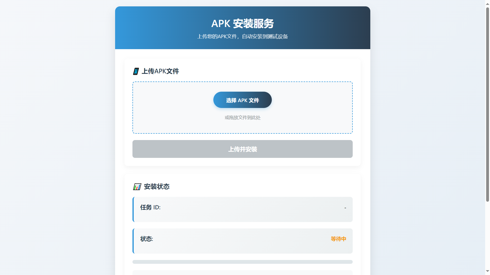
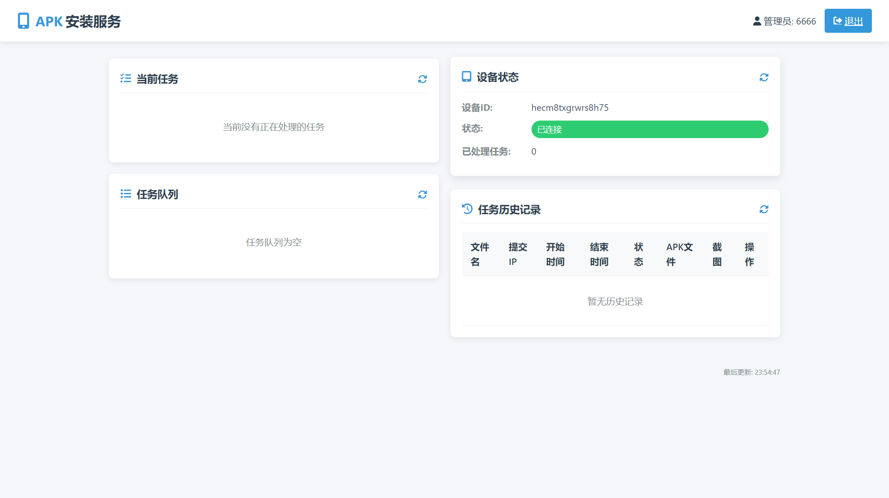

# H-NCTF2025-AndroidChecker

H&amp;NCTF2025安卓题目的checker方案与实现，用户上传APK文件后，系统会在连接的Android设备上安装并运行自动化测试脚本。如果测试通过，系统将返回Flag。

## 前言

在本次 H&NCTF 2025 中，我们实现了两个 Checker，分别用于 JustAndroid 的 PWN 题和 RealCrackMe。

JustAndroid Checker 的核心功能是在运行选手上传的 APK 后返回截图。为了防止选手上传与环境中 PWN 题所用 APK 包名相同的文件，从而覆盖原有环境，我在此 Checker 中使用了 androguard，用于在安装前提取 APK 的包名进行校验。但需要注意的是，androguard 的在解析包名时会带来一定的性能损耗。

因此，在 RealCrackMe Checker 中，我优化了检测方式，改为在 APK 安装完成后，通过检测当前运行的上层应用包名来判断是否为待测试包名，取消了在安装前对包名解析带来的时间及性能损耗。

值得一提的是，JustAndroid Checker 中原本也实现了安装前检测包名的逻辑，相关代码目前已被注释。如有需要，可参考并启用这部分代码。

## 环境依赖

### 系统要求
- Ubuntu 20.04 LTS 或更高版本
- Python 3.8+
- Android设备或模拟器（API 28+）
- 安装ADB

### Python依赖
- Flask
- uiautomator2
- loguru
- androguard
- requests

安装依赖：
```bash
pip install flask uiautomator2 loguru androguard requests
```

### Android环境
使用以下Docker命令创建Android 9模拟器环境：
```bash
docker pull budtmo/docker-android:emulator_9.0

docker run -d \
  --name=android9 \
  --privileged \
  -e DEVICE="Samsung Galaxy S10" \
  -e EMULATOR_ARGS="-no-window -gpu off -no-snapshot -noaudio -no-boot-anim -memory 1024" \
  -v /dev/kvm:/dev/kvm \
  -p 127.0.0.1:5555:5555 \ #这里在localhost监听是为了防止5555端口出网导致被直接连shell
  budtmo/docker-android:emulator_9.0
```

## 配置说明

### 环境变量
```bash
# Flask应用密钥
export SECRET_KEY='your_secret_key'

# 管理员凭据
export ADMIN_USERNAME='admin'
export ADMIN_PASSWORD='securepassword'

# 设备ID（模拟器或真机）
export DEVICE_ID="emulator-5554"
```

### 设备连接
确保设备已连接并启用USB调试：
```bash
adb devices
```

## 运行应用

1. 启动Flask应用：
```bash
python app.py
```

2. 访问Web界面：
```
http://localhost:5000
```

## 功能说明

### 用户界面
- 上传APK文件进行测试

- 查看任务状态和进度

- 查看测试结果和截图

  

### 管理员界面
- 查看所有任务队列

- 监控设备状态

- 管理历史任务

- 下载APK文件和测试截图

  

### 自动化测试流程

自动化测试通过uiautomator2实现：[openatx/uiautomator2: Android Uiautomator2 Python Wrapper (github.com)](https://github.com/openatx/uiautomator2)

1. 安装上传的APK
2. 启动应用程序
3. 执行10道题目的自动化测试
4. 验证破解结果
5. 卸载应用程序
6. 返回测试结果和Flag（如果成功）

## 注意事项

1. 每个IP地址同时最多只能有3个任务（1个运行中 + 2个排队）
2. APK文件大小限制为20MB
3. 测试完成后会自动卸载应用程序
4. 测试失败时会保存最后界面的截图
5. 管理员凭据默认从环境变量获取

## 文件结构
```
├── app.py                 # 主应用程序
├── templates/             # HTML模板
│   ├── index.html         # 用户界面
│   ├── admin.html         # 管理员界面
│   └── login.html         # 登录页面
├── uploads/               # 上传的APK文件
├── screenshots/           # 测试截图
├── requirements.txt       # Python依赖
└── README.md              # 项目文档
```

